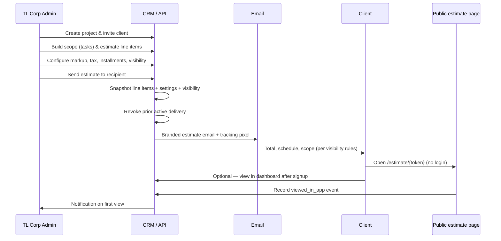

# Billing & Estimate System

Documentation for the Taylor Leonard CRM project estimate and billing workflow. This system covers **one-off TL Corp construction projects** (not Bonan Towers work).

Related scope notes: [`project-estimate-build.md`](./project-estimate-build.md)

---

## Overview

Admins build a project estimate by hand (line items, markup, tax, fees, payment milestones), configure what clients can see, then **send a frozen snapshot** to the customer by email. Clients can view the estimate without a CRM account via a public link; registered clients can also view it inside the dashboard.

Design priority: **total price, payment schedule, and scope are visible immediately**; terms and line-item detail appear below the fold.

---

## Lifecycle



### Step-by-step

| Step | Actor | Action |
|------|--------|--------|
| 1 | Admin | Create project, invite client (email invitation) |
| 2 | Admin | Build project scope / tasks (separate from billing) |
| 3 | Admin | Add estimate line items in **Estimate Builder** |
| 4 | Admin | Set markup, tax, online servicing fee, payment installments |
| 5 | Admin | Set **client visibility** (optional hide line prices / markup breakdown) |
| 6 | Admin | **Send to Client** — pick registered client or pending invite |
| 7 | Client | Receives email with breakdown + link to public estimate |
| 8 | Client | Opens estimate (email pixel + page view tracked) |
| 9 | Admin | Sees delivery status on project page (sent, opened, viewed) |

**Recipients:** Registered project clients **and** pending invitations (no CRM signup required to receive or view the estimate).

---

## Architecture

```
┌─────────────────────────────────────────────────────────────────┐
│                        Admin (Estimate Builder)                  │
│  app/dashboard/projects/[id]/page.tsx                           │
│  • Line items • Adjustments • Installments • Visibility • Send  │
└────────────────────────────┬────────────────────────────────────┘
                             │
         ┌───────────────────┼───────────────────┐
         ▼                   ▼                   ▼
  estimate_line_items   project_estimate_    projects
                        settings               (visibility flags)
         │                   │                   │
         └─────────┬─────────┴───────────────────┘
                   ▼
         POST /api/projects/[id]/estimate/send
                   │
                   ▼
         project_estimate_deliveries (snapshot)
         project_estimate_events (tracking)
                   │
         ┌─────────┴─────────┐
         ▼                   ▼
   sendProjectEstimateEmail   Client surfaces
   (lib/email.ts)             • /estimate/[token]  (public)
                              • /dashboard/projects/[id]/estimate
                              • Email HTML inline
```

---

## Data model

### `projects` (billing-related columns)

| Column | Type | Purpose |
|--------|------|---------|
| `budget_amount` | REAL | Updated to sent estimate total on send |
| `funding_notes` | TEXT | Summary note after send |
| `hide_line_item_prices_for_client` | INTEGER (0/1) | Hide rate/total per line for clients |
| `hide_markup_for_client` | INTEGER (0/1) | Hide subtotal/markup/tax/fee breakdown |

### `estimate_line_items`

Working draft line items for a project (admin-editable until send).

| Column | Purpose |
|--------|---------|
| `category` | Predefined category or `"custom"` |
| `custom_category_name` | Label when category is custom |
| `description` | Scope description |
| `price_rate` | Unit rate |
| `quantity` | Quantity |
| `total` | `price_rate × quantity` |
| `sort_order` | Display order |

**Categories** (`lib/estimate-categories.ts`): Demo, Carpentry, Electrical, Plumbing, Drywall/Mud/Taping, Coatings, Custom.

### `estimate_custom_entries`

Reusable saved line-item templates (name, description, default rate/qty) for similar future jobs. Managed via admin dashboard / API.

### `project_estimate_settings`

Per-project pricing and schedule (one row per project).

| Column | Purpose |
|--------|---------|
| `markup_type` | `percentage` or `fixed` |
| `markup_value` | Markup amount or % |
| `tax_rate` | Tax % applied after markup |
| `servicing_fee` | 3.5% online servicing fee on/off |
| `installment_schedule` | JSON array of milestones |
| `custom_terms` | Optional override for terms text |

Default installment schedule (`lib/estimate.ts`):

- Deposit 50% — Due on acceptance of contract  
- Rough-in 25% — Due after rough-in completion  
- Drywall 20% — Due after drywall is paint-ready  
- Final 5% — Due after final completion  

### `project_estimate_deliveries`

Immutable **snapshot** created each time an estimate is sent. Prior `sent` deliveries for the project are revoked.

| Column | Purpose |
|--------|---------|
| `snapshot_line_items` | JSON copy of line items at send time |
| `snapshot_settings` | JSON copy of settings + visibility flags at send time |
| `snapshot_total` | Grand total at send time |
| `tracking_token` | Public URL token (`/estimate/{token}`) |
| `sent_to_email` | Recipient email |
| `recipient_user_id` | User ID if registered; null for invite-only |
| `email_opened_at` | First email open (tracking pixel) |
| `first_viewed_at` | First in-app/public page view |
| `status` | `sent` or `revoked` |

### `project_estimate_events`

Audit log per delivery.

| `event_type` | When |
|--------------|------|
| `sent` | Estimate emailed |
| `email_opened` | Tracking pixel loaded |
| `viewed_in_app` | CRM estimate page or public page viewed |

---

## Pricing calculation

Shared logic in `lib/estimate.ts`:

```
subtotal     = sum(line_item.total)
markup       = percentage OR fixed (from settings)
afterMarkup  = subtotal + markup
tax          = afterMarkup × (tax_rate / 100)
afterTax     = afterMarkup + tax
servicingFee = afterTax × 0.035   (if servicing_fee enabled)
total        = afterTax + servicingFee
```

Installment amounts: `total × (milestone.percent / 100)` for each row in `installment_schedule`.

On send, `budget_amount` on the project is updated to the grand total and project signatures are cleared (estimate changed).

---

## Client visibility

Stored on **`projects`**, snapshotted into **`snapshot_settings`** when sending. Resolved at view time via `resolveClientVisibility()` in `lib/estimate.ts` (snapshot wins; falls back to live project flags for older deliveries).

Configured in:

- **Estimate Builder** → “What clients see” panel (saves immediately)
- **Project edit modal** → same two checkboxes

| Setting | Client sees | Client does not see |
|---------|-------------|---------------------|
| **Hide line-item prices** | Category, description, qty | Rate and line total |
| **Hide markup breakdown** | Grand total (and line prices if first toggle off) | Subtotal, markup, tax, servicing fee lines |

**Always shown regardless of toggles:**

- Grand total (prominent at top)
- **Payment schedule** — milestone label, %, due description, dollar amount
- Scope line items (with or without per-line pricing)
- Terms & conditions

Admin can use **Preview client view** in the Estimate Builder to see the table/summary as the client would.

---

## API routes

### Estimate CRUD (admin)

| Method | Route | Role | Purpose |
|--------|-------|------|---------|
| GET | `/api/projects/[id]/estimate` | Admin / Client | List items; client gets snapshot only if sent |
| POST | `/api/projects/[id]/estimate` | Admin | Add line item |
| PATCH | `/api/projects/[id]/estimate` | Admin | Update line item |
| DELETE | `/api/projects/[id]/estimate` | Admin | Delete line item |

### Settings

| Method | Route | Role | Purpose |
|--------|-------|------|---------|
| GET/PATCH | `/api/projects/[id]/estimate/settings` | Admin | Markup, tax, fee, installments, custom terms |

### Send & delivery

| Method | Route | Role | Purpose |
|--------|-------|------|---------|
| POST | `/api/projects/[id]/estimate/send` | Admin | Create snapshot, send email |
| GET | `/api/projects/[id]/estimate/send` | Admin | List send recipients |
| GET | `/api/projects/[id]/estimate/deliveries` | Admin | Delivery history |
| POST | `/api/projects/[id]/estimate/view` | Client / Public | Record CRM view event |

### Public (no auth)

| Method | Route | Purpose |
|--------|-------|---------|
| GET | `/api/estimate/public/[token]` | Load snapshot for public page |
| POST | `/api/estimate/public/[token]` | Record view + notify admin |

### Tracking

| Method | Route | Purpose |
|--------|-------|---------|
| GET | `/api/tracking/estimate/[token]/open` | 1×1 pixel; marks email opened |

### Other

| Method | Route | Purpose |
|--------|-------|---------|
| GET | `/api/projects/[id]/export-pdf` | Branded PDF export |
| GET/POST | `/api/estimate/custom-entries` | Reusable estimate templates |

### Send payload (POST send)

```json
{
  "recipient_email": "client@example.com",
  "recipient_user_id": "optional-user-id"
}
```

Either field identifies the recipient. Pending invites work with `recipient_email` only.

---

## UI surfaces

| Surface | Path | Audience |
|---------|------|----------|
| Estimate Builder | `/dashboard/projects/[id]` | Admin — build, configure, send |
| Client estimate viewer | `/dashboard/projects/[id]/estimate` | Client (after send) / Admin |
| Public estimate | `/estimate/[token]` | Anyone with link — no login |
| Shared viewer component | `app/components/EstimateViewer.tsx` | Used by client + public pages |

**Estimate Builder sections:**

1. Header — running total, Add Item, Send to Client  
2. Delivery status — sent time, email opened, viewed, sent total  
3. What clients see — visibility toggles + preview  
4. Line items table — category, description, rate, qty, total, actions  
5. Adjustments — markup, tax, online fee  
6. Payment installments — editable milestone table  
7. Totals — subtotal through grand total  

**Send modal:** Pick recipient (registered or “invite pending”), shows total and visibility summary.

---

## Email & notifications

`sendProjectEstimateEmail()` in `lib/email.ts`:

- Taylor Leonard branded HTML template  
- **Total estimate** hero block  
- Scope table (respects visibility)  
- Pricing summary (if not hidden)  
- **Payment schedule** table  
- CTA: **View Full Estimate Online** → `/estimate/{tracking_token}`  
- Pending invites: optional **Create your CRM account** → `/register?invite={token}`  
- Tracking pixel → `/api/tracking/estimate/{token}/open`  

Admin notifications (`lib/email.ts`):

| Function | Trigger |
|----------|---------|
| `sendEstimateEmailOpenedNotification` | Recipient opens email (pixel) |
| `sendEstimateViewedNotification` | First view on CRM or public page |

---

## Access control

| Role | Estimate builder | Line item prices | Send | View sent estimate |
|------|------------------|------------------|------|-------------------|
| **Admin** | Full | Yes | Yes | Yes (live draft or snapshot) |
| **Client** | No | Per visibility rules | No | Yes — only after admin send |
| **Employee** | Blocked | Stripped from project APIs | No | No |

Employees cannot access estimate APIs or PDF export. Project list/detail responses use `stripProjectPricingForEmployee()` to remove budget and visibility fields.

Clients cannot view an estimate until an active `project_estimate_deliveries` row exists with `status = 'sent'`.

---

## Key files

| Area | Path |
|------|------|
| Schema | `db/schema.sql` |
| Project + delivery DB helpers | `lib/projects.ts` |
| Pricing math & visibility | `lib/estimate.ts` |
| Categories | `lib/estimate-categories.ts` |
| Terms copy | `lib/estimate-terms.ts` |
| Email templates | `lib/email.ts` |
| Admin builder UI | `app/dashboard/projects/[id]/page.tsx` |
| Client viewer page | `app/dashboard/projects/[id]/estimate/page.tsx` |
| Public viewer page | `app/estimate/[token]/page.tsx` |
| Shared viewer | `app/components/EstimateViewer.tsx` |
| Send API | `app/api/projects/[id]/estimate/send/route.ts` |
| Public API | `app/api/estimate/public/[token]/route.ts` |
| Migration (if needed) | `scripts/migrate-project-estimate-delivery.ts` |

---

## Future considerations (not implemented)

From original scope — optional later work:

- ChatGPT-assisted pricing suggestions  
- Stronger reuse of `estimate_custom_entries` from the project builder (“Load from saved entry”)  
- Dedicated `lib/estimate-pdf.ts` shared module (PDF logic currently in export route)  

---

## Quick reference: what the client gets

**Both visibility toggles ON (simplest client view):**

- Total estimate  
- Payment schedule with amounts  
- Scope list (category, description, quantity — no per-line prices)  
- Terms & conditions  
- No markup/tax/fee breakdown  

**Both toggles OFF (full transparency):**

- Everything above plus line rates/totals and full subtotal → markup → tax → fee → total breakdown  
